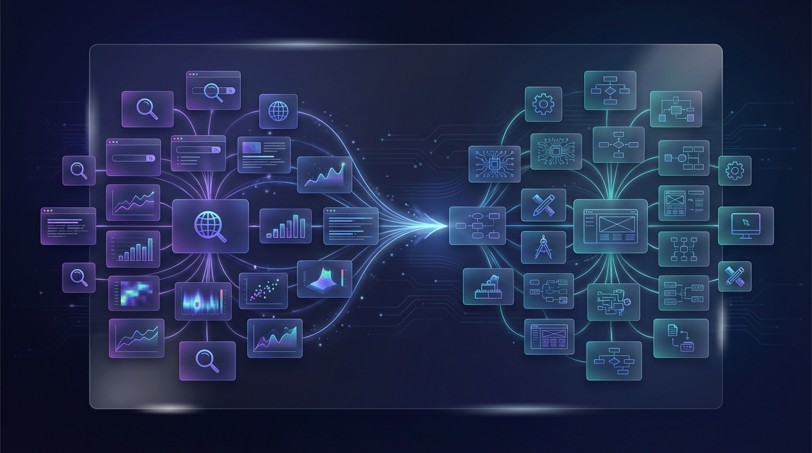
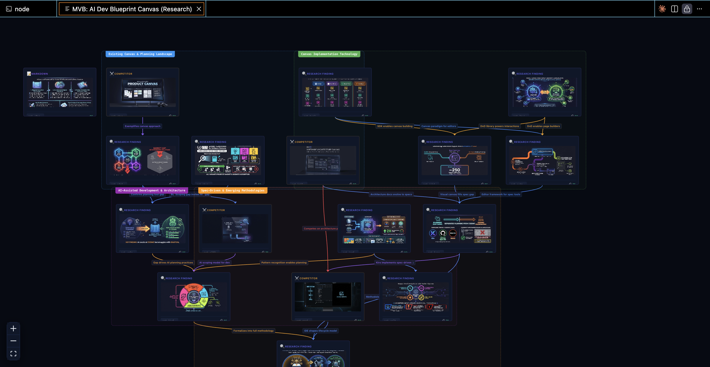
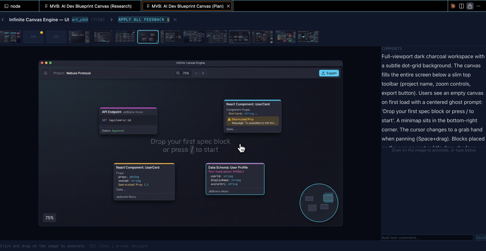
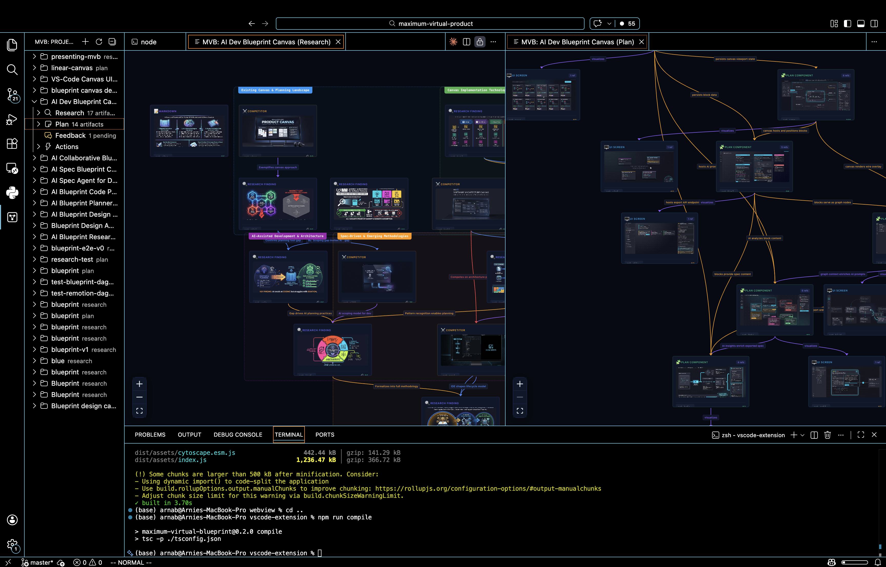

# Maximum Virtual Product (MVP)

### From idea to actionable product blueprint in 5 minutes

AI-powered research & product blueprint system — parallel Claude Opus 4.6 agents search the web, synthesize findings on an interactive canvas, and generate grounded product plans.

[](LICENSE)
[](https://python.org)
[](https://typescriptlang.org)
[](https://anthropic.com)



---

## What It Does

### 1. Onboarding

Name your topic, describe what you want to build, then answer AI-generated clarifying questions that refine the research scope.

### 2. Research — 4 Parallel Opus 4.6 Agents

Multiple Claude Opus 4.6 agents research different angles in parallel — competitors, trends, pain points, technical approaches — using Claude's built-in web search. Findings stream in real-time as interconnected artifact cards on a React Flow canvas, complete with AI-generated images (Gemini).



### 3. Plan Directions

After research completes, Claude analyzes all findings and suggests 2–3 strategic approaches. Pick one, combine them, or provide your own direction to guide the blueprint.

### 4. Blueprint Generation

Claude breaks your product into detailed blueprint components — each referencing research findings by artifact ID — with Mermaid architecture diagrams. Review any section and request feedback-driven regeneration.



### 5. Export

Plans export as implementation-ready Markdown. Research findings export as narrated video via Remotion, including animated Mermaid diagrams.

---

## How Opus 4.6 Powers Everything

MVP makes **8+ distinct Claude Opus 4.6 calls** across the entire workflow, leveraging adaptive thinking and tool use at every stage:

| Stage | What Opus 4.6 Does |
|-------|-------------------|
| **Clarifying Questions** | Generates targeted questions to refine research scope based on the user's topic and description |
| **Research Planning** | Analyzes the topic + clarifying answers to produce a structured research plan with parallel agent assignments |
| **Web Search Synthesis** | Each of 4 parallel sub-agents uses Claude's built-in `web_search_20250305` tool to search, read, and synthesize — no external search API needed. Uses `pause_turn` for multi-step search continuation |
| **Research Summarization** | Synthesizes all parallel agent findings into a unified research narrative |
| **Plan Direction Suggestions** | Analyzes research artifacts to suggest 2–3 strategic approaches with trade-offs |
| **Design Preference Dimensions** | Generates preference dimensions tailored to the domain for guiding plan style |
| **Plan Generation** | Produces a full product blueprint with Mermaid architecture diagrams, cross-referencing research artifact IDs |
| **Artifact Regeneration** | Accepts user feedback on any artifact and regenerates it in context |

### Parallel Sub-Agent Orchestration

The research phase spawns **4 concurrent Opus 4.6 agents**, each with their own independent web search context. A coordinator agent plans the research, assigns sub-topics, and a summarizer synthesizes all findings — all streamed in real-time via WebSocket.

### Cross-Phase Artifact Referencing

Every artifact gets a short copyable ID (e.g., `art_7kx9`). Plan components reference research artifacts by ID, so blueprints are **grounded in actual research** — not hallucinated plans. Opus 4.6's ability to maintain coherent cross-document reasoning makes this possible.

---

## Impact

- **Replaces weeks of work**: Manual market research + product planning condensed into a 5-minute AI-powered flow
- **Accessible to everyone**: Any founder, PM, or developer can go from idea → research → actionable blueprint
- **Grounded decisions**: Cross-references research → plan by artifact ID, ensuring plans are based on real findings — not hallucinations
- **Available everywhere**: Web app, VS Code extension, and Claude Code MCP server

---

## Architecture

```
React 19 + React Flow + Zustand        VS Code Extension
        │ REST + WebSocket                    │ WebSocket
        ▼                                     ▼
FastAPI + Claude Opus 4.6 ◄──── MCP Server (Claude Code)
├── Research coordinator agent
│   └── 4× parallel research sub-agents
│       └── Claude built-in web search (web_search_20250305)
├── Image generation (Google Gemini)
├── Plan breakdown service
│   └── Mermaid diagram generation
├── GitHub OAuth
└── Supabase persistence + storage
```

### Key Engineering Highlights

- **DAG enforcement** — Cycle removal algorithm ensures artifact connection graphs remain valid directed acyclic graphs
- **Real-time WebSocket streaming** — All research events, plan progress, and artifact updates stream live to the client
- **Dagre auto-layout** — Automatic graph layout positions artifact nodes and group nodes on the canvas
- **Custom React Flow nodes** — `ArtifactNode` and `GroupNode` with expand/collapse, copy ID, and rich content rendering
- **Mermaid diagram rendering** — Architecture and flow diagrams rendered inline within plan artifacts
- **Fire-and-forget image generation** — Gemini image requests run in parallel without blocking the research pipeline
- **GitHub OAuth** — Secure authentication for persisting projects across sessions

---

## Surfaces

| Surface | Description |
|---------|-------------|
| **Web App** | React 19 + Vite — deployed at [mvb-global.com](https://mvb-global.com) |
| **VS Code Extension** | Maximum Virtual Blueprint (v0.2.5) — brings the canvas directly into the IDE |
| **MCP Server** | Claude Code integration — drive the entire workflow from the terminal via MCP tools |
| **Video Export** | Remotion-powered narrated video export of research findings |



---

## Quick Start

### Prerequisites
- Python 3.12+
- Node.js 20+
- Supabase project
- Anthropic API key
- Google Gemini API key (for image generation)

### Environment Variables

Create `backend/.env` from the example:

```bash
cp backend/.env.example backend/.env
```

| Variable | Required | Description |
|----------|----------|-------------|
| `ANTHROPIC_API_KEY` | Yes | Claude API key |
| `SUPABASE_URL` | Yes | Supabase project URL |
| `SUPABASE_KEY` | Yes | Supabase anon key |
| `SUPABASE_SERVICE_ROLE_KEY` | Yes | Supabase service role key (for storage uploads) |
| `GEMINI_API_KEY` | Yes | Google Gemini API key (image generation) |

### Setup

```bash
# Backend
cd backend
pip install -e .
uvicorn app.main:app --reload

# Frontend (new terminal)
cd frontend
npm install
npm run dev

# Video export (optional, new terminal)
cd video
npm install
npx remotion studio
```

### Database

Run the migrations in your Supabase SQL editor:
- `backend/migrations/001_initial.sql`
- `backend/migrations/002_add_image_url.sql`

Open http://localhost:5173

---

## Tech Stack

| Layer | Technology |
|-------|-----------|
| Frontend | React 19, React Flow (@xyflow/react), Zustand, Tailwind CSS v4 |
| Animations | Framer Motion |
| Diagrams | Mermaid, dagre (DAG layout) |
| Markdown | react-markdown, remark-gfm |
| Backend | FastAPI, Anthropic SDK, httpx, readability-lxml |
| AI | Claude Opus 4.6 (research + planning), Google Gemini (image generation) |
| Search | Claude built-in web search (`web_search_20250305`) |
| Database | Supabase (PostgreSQL + Storage) |
| Auth | GitHub OAuth |
| Video | Remotion |
| Extension | VS Code Webview API, WebSocket |
| CLI | MCP server for Claude Code |

---

## License

[MIT](LICENSE) — Copyright (c) 2025 Arnab Ghosh
